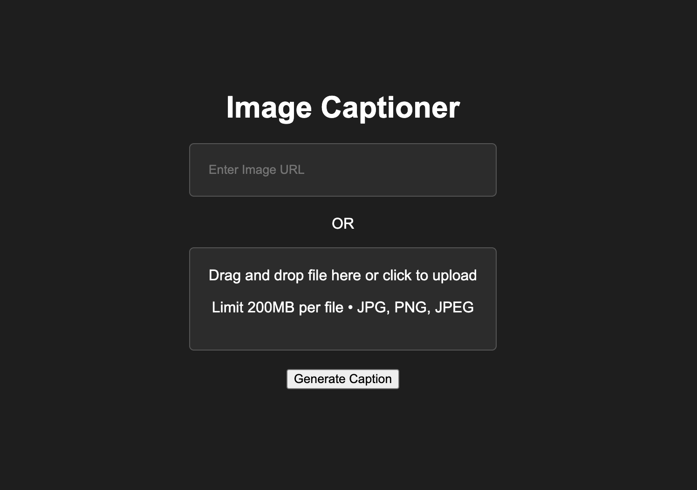

# 🖼️ Image Caption Generator 



Implements an Image Captioning model using a Transformer-based approach. The model is trained to generate descriptive captions for images, leveraging advanced deep learning techniques.

## 📁 Project Structure

```bash
├── App.py                     # Flask backend to serve the model
├── Generator_fn.py            # Script containing the generate_caption function and model loading logic
├── ImageCaptioning_Transformer.ipynb  # Jupyter notebook for model training and experimentation
├── Index.html                 # Frontend HTML file for the web interface
├── kaggle.json                # Kaggle API key for dataset access
├── tmp.png                    # Temporary image for processing
├── frontend_img.png           # Image used in the README and project documentation
├── images/                    # Directory containing image datasets
```

## 🚀 Getting Started
Follow these steps to get the project up and running on your local machine.

### Prerequisites
Make sure you have the following installed:
- Python 3
- Flask
- TensorFlow
- Jupyter Notebook

### Installation

1. **Clone the Repository**:
   ```bash
   git clone https://github.com/Sanjit1806/ImageCaption_Generator.git
   cd your-repository
   ```

2. **Install Dependencies**:
    ```bash
    pip install -r requirements.txt
    ```

3. **Set Up Kaggle API**:
   Place your kaggle.json file in the root directory to download datasets from Kaggle.

4. **Run the Jupyter Notebook**:
   Open and run ImageCaptioning_Transformer.ipynb to train the model or modify it.

5. **Start the Flask Server**:
   ```bash
    python App.py
    ```
6. **Open the Webpage**:
   Go to http://127.0.0.1:5000/ in your web browser to use the image captioning tool.

## 🖥️ Usage
The web interface allows you to upload an image or provide an image URL to generate a caption.

- Image URL: Enter a URL to an image hosted online.
- Image Upload: Upload an image from your local device.

Here’s a simple example:
1. Open the webpage.
2. Upload an image or enter a URL.
3. Click "Generate Caption".
4. The generated caption will be displayed below the image.

## 📊 Dataset
The image and caption dataset used for training the model can be downloaded from kaggle. Link provided in Dataset/Images.txt

## 🛠️ Model Architecture
The model is based on the Transformer architecture, which is known for its effectiveness in natural language processing tasks. It uses an attention mechanism to generate captions for images.

## 🧪 Experimentation
The ImageCaptioning_Transformer.ipynb notebook contains code for training and fine-tuning the model. You can experiment with different hyperparameters and architectures.

## 📈 Results
The model has been trained on a subset of images and is capable of generating captions with a reasonable level of accuracy.

## 🌐 Deployment
This project uses Flask for deployment, allowing you to serve the model via a web interface.

## 🤝 Contributors
- Developed by [github.com/Sanjit1806](https://github.com/Sanjit1806)
- Based from [github.com/pritishmishra703](https://github.com/pritishmishra703)
- Dataset from [github.com/adityajn105](https://github.com/adityajn105)
